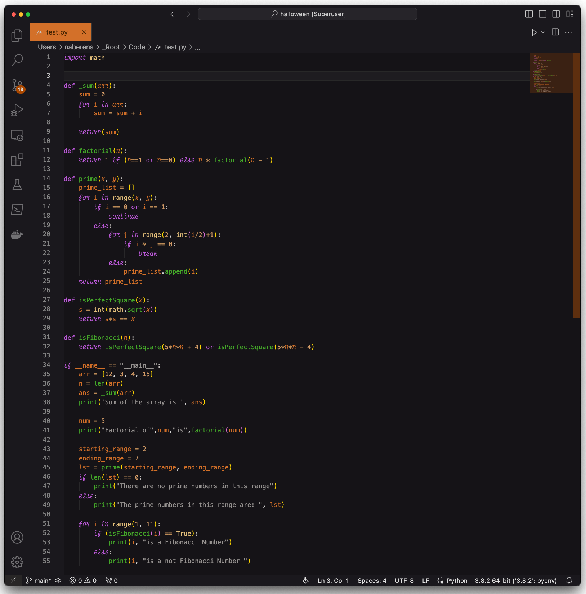

# halloween

A simple dark theme for Halloween



• install this theme  
• install [Custom CSS and JS Loader](https://marketplace.visualstudio.com/items?itemName=be5invis.vscode-custom-css)
• link the CSS file from this extension in your vscode settings.json: 

```
On Mac it might look something like the snippet below:

{∏
  "vscode_custom_css.imports": [
    "file:///Users/{your username}/.vscode/extensions/naberens.dark-halloween-0.4.0/cursive-style.css"
    ]
}

Windows might resemble:

{
  "vscode_custom_css.imports": [
    "file:///C:/Users/{your username}/.vscode/extensions/naberens.dark-halloween-0.4.0/cursive-style.css"
    ]
}
```
• From the command panel, select `Reload Custom CSS and JS`. You'll need to run this command every time vscode updates.

## Font
The fonts being used in the screenshot above are [Operator Mono with Ligatures](https://github.com/kiliman/operator-mono-lig) for regular text and [Victor Mono](https://rubjo.github.io/victor-mono) for cursive